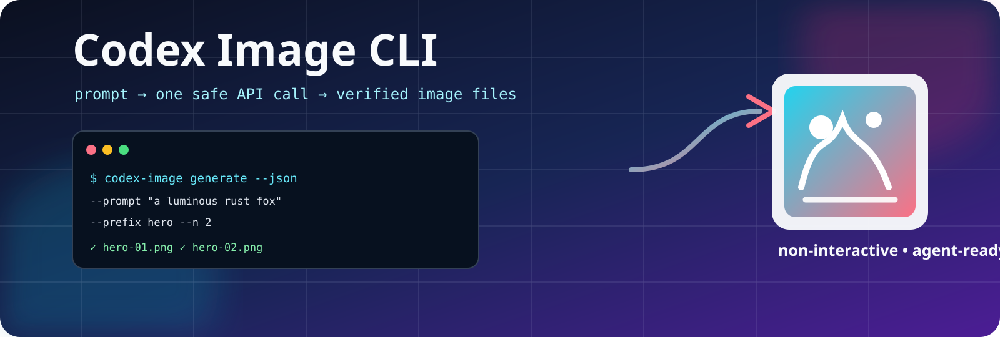

<p align="center">
  
</p>

# Codex Image CLI 🖼️⚡

> A safe, non-interactive Rust CLI for generating OpenAI GPT Image 2 assets from any terminal or AI agent.

[](https://github.com/dmoliveira/codex-image-cli/actions/workflows/ci.yml)
[](https://github.com/dmoliveira/codex-image-cli/releases)
[](https://www.rust-lang.org/)
[](https://platform.openai.com/docs/guides/image-generation)
[](LICENSE)
[](https://buy.stripe.com/8x200i8bSgVe3Vl3g8bfO00)

## Why this exists 🎯

AI tools such as OpenCode need a small, predictable image command—not a browser flow or an interactive wizard. `codex-image` provides:

- 🤖 **Agent-ready JSON** via `ai-help --json`, `doctor --json`, and `generate --json`
- 🧾 **One explicit generation operation** per command; no automatic retry of billable image requests
- 📁 **Safe deterministic files** with collision protection, staged writes, and controlled `--overwrite`
- 🔒 **Explicit providers**: direct Image API by default, authenticated Codex CLI via `--provider codex`
- ⏳ **Durable Batch lifecycle**: submit, inspect, retrieve, and cancel bounded API jobs without hidden retries
- 🧪 **Offline-friendly validation**: `--dry-run`, unit tests, fake-API integration tests, and a tmux E2E harness

## Important account reality ⚠️

The direct Image API is the default provider and reads `OPENAI_API_KEY` only from the environment. The explicit `--provider codex` path delegates to the locally authenticated Codex CLI and validates the resulting PNG before publishing it.

ChatGPT/Codex subscriptions and API billing remain separate. API access can also require billing setup and [organization verification](https://help.openai.com/en/articles/10910291-api-organization-verification).

## Install from any terminal 🚀

The binary builds where Rust builds. For the public release, **real generation is supported on macOS and Linux** through a descriptor-pinned secure output backend. Other platforms can use `--dry-run`; they fail closed before any API request rather than falling back to racy filesystem operations.

### Install a tagged release with Cargo

```bash
cargo install --git https://github.com/dmoliveira/codex-image-cli.git \
  --tag v0.1.0 \
  --locked \
  codex-image-cli
```

The `codex-image` binary is placed in Cargo's bin directory (normally `~/.cargo/bin`). Ensure that directory is on `PATH`:

```bash
export PATH="$HOME/.cargo/bin:$PATH"
codex-image --help
```

### Install a local checkout

```bash
git clone https://github.com/dmoliveira/codex-image-cli.git
cd codex-image-cli
cargo install --path . --locked
```

### Update deliberately

Install a specific [released version](https://github.com/dmoliveira/codex-image-cli/releases) rather than silently tracking a branch:

```bash
cargo install --git https://github.com/dmoliveira/codex-image-cli.git \
  --tag vX.Y.Z \
  --locked \
  --force \
  codex-image-cli
```

Verify the published checksum from the release before installing artifacts directly. Cargo builds source from the named tag.

## Fast start ✨

```bash
# 1. Check local providers without generating an image.
codex-image doctor --json

# 2. Prepare an explicit output directory and validate the plan.
mkdir -p artifacts/design
codex-image generate \
  --prompt "A warm editorial illustration of a rust-orange fox using a terminal" \
  --output-dir artifacts/design \
  --prefix fox-terminal \
  --n 1 \
  --size 1024x1024 \
  --quality low \
  --dry-run \
  --json

# 3. Generate through the direct Image API after the dry run looks right.
codex-image generate \
  --provider api \
  --prompt "A warm editorial illustration of a rust-orange fox using a terminal" \
  --output-dir artifacts/design \
  --prefix fox-terminal \
  --n 1 \
  --size 1536x1024 \
  --quality low \
  --json
```

That writes `fox-terminal.png` after the generated PNG has passed container validation.

The default API provider supports the documented Image API parameters. Use `--provider codex` for the explicit local subscription path; it currently supports one PNG per command. Use the Batch commands below for bounded asynchronous API jobs.

## For AI agents 🤖

Ask the installed binary for its machine contract:

```bash
codex-image ai-help --json
```

Required facts for an agent:

| Need | Safe action |
| --- | --- |
| Prompt | `--prompt TEXT` or `--prompt-file FILE` (UTF-8 file; `-`/stdin is refused) |
| Structured request | `--request-file FILE` with versioned JSON; exclusive with generation flags |
| Provider | Omit `--provider` for the direct Image API; use `--provider codex` for the authenticated Codex CLI subscription |
| Capabilities | `codex-image ai-help --json` returns supported, best-effort, and unsupported fields per provider |
| Output directory | Create it first; it must be non-symlinked and already exist |
| One output | `--name hero` with `--n 1` |
| Several outputs | `--prefix hero --n 3` → `hero-01.png` … `hero-03.png` |
| No-cost planning | Add `--dry-run --json`; it reads no key and opens no network connection |
| Result parsing | Use `--json`; stdout contains exactly one JSON document |

Read the full [AI agent guide](docs/AI-AGENT-GUIDE.md) and [JSON/exit-code contract](docs/API-CONTRACT.md).

## Parameters 🛠️

```text
codex-image generate --prompt <TEXT> [OPTIONS]
```

| Option | Default | Notes |
| --- | --- | --- |
| `--prompt TEXT` | required* | Prompt text. Use a UTF-8 `--prompt-file FILE` up to 256 KiB for long local prompts. |
| `--request-file FILE` | — | Version 1 JSON generation request; cannot be combined with generation-setting flags. |
| `--n COUNT` | `1` | 1–4 images in one request. |
| `--output-dir DIR` | `.` | Existing, non-symlink directory. The CLI never creates it implicitly. |
| `--name STEM` | — | Exact safe stem for one image only: `hero` → `hero.png`. |
| `--prefix STEM` | `codex-image` | Safe stem for one/many images: `hero` + 3 → `hero-01.png` … |
| `--format` | `png` | `png`, `jpeg`, or `webp`; response container is verified. |
| `--size` | `1024x1024` | `auto` or `WIDTHxHEIGHT` within documented GPT Image 2 constraints. Use `--size auto` or a larger explicit size deliberately. |
| `--quality` | `low` | `low`, `medium`, `high`, or `auto`; `high` requires `--confirm-high-quality`. |
| `--background` | `auto` | `auto` or `opaque`; GPT Image 2 currently rejects transparent output. |
| `--compression` | — | 0–100 for JPEG/WebP only. |
| `--moderation` | `auto` | `auto` or `low`, following the documented API option. |
| `--overwrite` | off | Atomically exchanges a regular target, then validates that the displaced identity matches preflight. A mismatch is never called success; successful replacements retain a private backup listed in `retained_artifacts`. |
| `--timeout-seconds` | `180` | 1–300 seconds, one request only. |
| `--dry-run` | off | No key read, file reservation, DNS, proxy, or HTTP request. |
| `--json` | off | Stable JSON schema on stdout; diagnostics are not mixed in. |

`*` Exactly one of `--prompt` and `--prompt-file` is required.

### Structured request file

Use a request file when an agent already has typed parameters:

```json
{
  "schema_version": 1,
  "prompt": "A warm editorial illustration of a rust-orange fox using a terminal",
  "provider": "codex",
  "size": "1024x1024",
  "quality": "medium"
}
```

```bash
codex-image generate \
  --request-file request.json \
  --output-dir artifacts/design \
  --name fox-terminal \
  --dry-run \
  --json
```

The file cannot authorize overwrites, custom endpoints, API-key destinations, or insecure HTTP. Use CLI flags for those explicit trust decisions.

### Batch lifecycle

Batch is an explicit API-only workflow. It accepts at most 8 image requests locally, writes a durable job record, and never silently resubmits an upload or creation POST:

```bash
codex-image batch submit \
  --provider api \
  --prompt "A warm editorial illustration of a rust-orange fox using a terminal" \
   --output-dir artifacts/design \
   --prefix fox-batch \
   --n 2 \
   --quality low \
   --job-file artifacts/design/fox-batch-job.json \
  --json

codex-image batch status \
  --job-file artifacts/design/fox-batch-job.json \
  --json

codex-image batch retrieve \
  --job-file artifacts/design/fox-batch-job.json \
  --wait \
  --max-wait-seconds 300 \
  --json
```

Use `batch cancel --job-file FILE --json` when cancellation is appropriate. The job record contains remote IDs and recovery state but never stores the prompt, API key, or image data. Batch output is configured to expire after 30 days; retrieve results before expiry. Inspect `retained_artifacts` and `possibly_modified_paths` before any cleanup.

For a custom endpoint, repeat its exact `--dangerously-allow-api-key-to ORIGIN` approval on each status/retrieve/cancel/recover command. For loopback test endpoints, repeat `--allow-insecure-localhost`; trust approvals are intentionally not taken from an editable job file.

Use `batch recover --job-file FILE --json` for a job left in the safe `input_uploaded` state. For an unknown upload outcome, first inspect the remote Files API and pass `--input-file-id FILE_ID`; for an unknown create outcome, inspect the remote Batches API and pass `--batch-id BATCH_ID`. These explicit reconciliation flags never cause an automatic upload or duplicate creation.

### Endpoint overrides (advanced) 🔐

The default is exactly `https://api.openai.com/v1`. For a local fake API, use loopback HTTP only with an explicit acknowledgement:

```bash
codex-image generate ... \
  --api-base-url http://127.0.0.1:8080/v1 \
  --allow-insecure-localhost
```

Any custom **HTTPS** origin additionally requires an exact credential-destination acknowledgement:

```bash
codex-image generate ... \
  --api-base-url https://images.example.test/v1 \
  --dangerously-allow-api-key-to https://images.example.test
```

The CLI rejects non-loopback HTTP, embedded URL credentials, query/fragment URLs, redirects, and proxy use. Treat a custom origin as a deliberate decision to send your API key to that service.

## Cost and failure safety 🧯

`codex-image` never retries the API POST. It uses these stable exit codes:

| Code | Status | Meaning |
| ---: | --- | --- |
| 0 | `success` / `dry_run` | All requested outputs were published, or no-op planning succeeded. |
| 2 | `usage_error` | Local flags, prompt, key presence, or endpoint policy need correction. |
| 3 | `preflight_error` | Output directory/path reservation failed; no POST was attempted. |
| 4 | `api_rejected` | A definitive 4xx API response arrived. |
| 5 | `outcome_indeterminate` | Transport/redirect/5xx failure; the POST may have been processed. **Do not retry automatically.** |
| 6 | `invalid_success_response` | A 2xx response could not safely produce files. **Do not retry automatically.** |
| 7 | `output_commit_failed` | Valid returned data could not be completely published. **Do not retry automatically.** |
| 8 | `batch_not_ready` | A Batch job is still processing or exceeded its bounded wait. Query it again later. |
| 9 | `batch_observation_failed` | A read-only Batch status or output observation failed; retrying the observation is safe. |
| 10 | `batch_failed` | A Batch reached a failed or expired terminal state, or its output expired; inspect its error/output file before deciding what to do next. |

For codes 5–7, check API activity and inspect any `possibly_modified_paths` in JSON before deciding what to do next. Successful overwrites expose private backup paths in `retained_artifacts`; error paths retain only private transaction artifacts rather than performing unsafe pathname cleanup. Batch submission and cancellation outcomes are also never automatically retried. See [the complete contract](docs/API-CONTRACT.md).

## Quality checks ✅

```bash
make help
make check
make e2e
```

`make e2e` starts a local fake Image API in a detached `tmux` session, closes stdin, generates a PNG through the real binary, validates its signature/JSON, asserts one request, verifies the test key was not logged, and cleans up.

## Support this project 💛

This is MIT-licensed software; voluntary support never unlocks or restricts CLI features.

- [Support via Stripe](https://buy.stripe.com/8x200i8bSgVe3Vl3g8bfO00)
- [Open a GitHub issue](https://github.com/dmoliveira/codex-image-cli/issues) for bugs and ideas

## Security and contribution 📚

- [Security policy](SECURITY.md)
- [Contributing](CONTRIBUTING.md)
- [Changelog](CHANGELOG.md)
- [API contract](docs/API-CONTRACT.md)
- [AI agent guide](docs/AI-AGENT-GUIDE.md)

`codex-image-cli` is an independent open-source project and is not affiliated with or endorsed by OpenAI.
